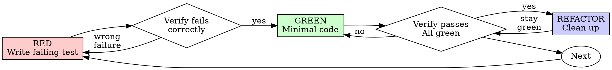

# Test-Driven Development (TDD)

## Scope and evidence

For testable behavior changes, write a focused failing test, implement the
smallest fix, then refactor while preserving the behavior. The test must detect
the requirement or regression rather than mirror implementation details.

For documentation, mechanical configuration edits, generated output, or a
throwaway probe, use the relevant validation instead of inventing a unit test.
Configuration that changes runtime behavior still needs an appropriate regression
or integration check. State the verification chosen; an already authorized task
needs no new approval merely because TDD is inapplicable.

If implementation already exists without a regression test, preserve it. Add a
test for the original requirement, demonstrate failure with only the relevant
fix temporarily absent, restore the fix, and verify passing. Use a reversible
local change or disposable fixture; never discard unrelated work. If the original
failure cannot be reproduced safely, report that evidence gap. Do not describe
this recovery as test-first development.

## Red-Green-Refactor



### RED - Write Failing Test

Write one minimal test showing what should happen.

<Good>
```typescript
test('retries failed operations 3 times', async () => {
  let attempts = 0;
  const operation = () => {
    attempts++;
    if (attempts < 3) throw new Error('fail');
    return 'success';
  };

  const result = await retryOperation(operation);

  expect(result).toBe('success');
  expect(attempts).toBe(3);
});
```
Clear name, tests real behavior, one thing
</Good>

<Bad>
```typescript
test('retry works', async () => {
  const mock = jest.fn()
    .mockRejectedValueOnce(new Error())
    .mockRejectedValueOnce(new Error())
    .mockResolvedValueOnce('success');
  await retryOperation(mock);
  expect(mock).toHaveBeenCalledTimes(3);
});
```
Vague name, tests mock not code
</Bad>

**Requirements:**
- One behavior
- Clear name
- Real code (no mocks unless unavoidable)

### Verify RED - Watch It Fail

Run the test before implementing when using the test-first path. For existing
implementation, use the recovery procedure and report any unavailable proof.

```bash
npm test path/to/test.test.ts
```

Confirm:
- Test fails (not errors)
- Failure message is expected
- Fails because feature missing (not typos)

**Test passes?** Check whether the behavior already exists. For a regression
added after implementation, use the recovery procedure above; do not weaken the assertion.

**Test errors?** Fix error, re-run until it fails correctly.

### GREEN - Minimal Code

Write simplest code to pass the test.

<Good>
```typescript
async function retryOperation<T>(fn: () => Promise<T>): Promise<T> {
  for (let i = 0; i < 3; i++) {
    try {
      return await fn();
    } catch (e) {
      if (i === 2) throw e;
    }
  }
  throw new Error('unreachable');
}
```
Just enough to pass
</Good>

<Bad>
```typescript
async function retryOperation<T>(
  fn: () => Promise<T>,
  options?: {
    maxRetries?: number;
    backoff?: 'linear' | 'exponential';
    onRetry?: (attempt: number) => void;
  }
): Promise<T> {
  // YAGNI
}
```
Over-engineered
</Bad>

Don't add features, refactor other code, or "improve" beyond the test.

### Verify GREEN - Watch It Pass

**MANDATORY.**

```bash
npm test path/to/test.test.ts
```

Confirm:
- Test passes
- Affected existing checks still pass
- Investigate relevant warnings and failures; distinguish pre-existing issues

**Test fails?** Fix code, not test.

**Other tests fail?** Fix failures caused by the change. Report unrelated failures
without expanding the task silently.

### REFACTOR - Clean Up

After green only:
- Remove duplication
- Improve names
- Extract helpers

Keep tests green. Don't add behavior.

### Repeat

Next failing test for next feature.

## Good Tests

| Quality | Good | Bad |
|---------|------|-----|
| **Minimal** | One thing. "and" in name? Split it. | `test('validates email and domain and whitespace')` |
| **Clear** | Name describes behavior | `test('test1')` |
| **Shows intent** | Demonstrates desired API | Obscures what code should do |

When writing or changing any test, read [writing-good-tests.md](writing-good-tests.md) for the rules that keep tests honest:
- Name the production change that would make the test fail — before writing it
- Assert on real behavior, never on mock behavior
- Keep test-only code in test utilities, out of production classes
- Understand a dependency's side effects before mocking it

## Evidence gaps to resolve

- A test passing only with the new implementation does not demonstrate it can
  detect the regression. Exercise the failing condition too.
- Manual inspection may validate appearance, but does not establish automated
  regression coverage. Report each form of evidence accurately.
- A hard-to-test behavior may expose a boundary problem. Use the established
  test stack and make the smallest useful seam; avoid unrelated restructuring.

## Example: Bug Fix

**Bug:** Empty email accepted

**RED**
```typescript
test('rejects empty email', async () => {
  const result = await submitForm({ email: '' });
  expect(result.error).toBe('Email required');
});
```

**Verify RED**
```bash
$ npm test
FAIL: expected 'Email required', got undefined
```

**GREEN**
```typescript
function submitForm(data: FormData) {
  if (!data.email?.trim()) {
    return { error: 'Email required' };
  }
  // ...
}
```

**Verify GREEN**
```bash
$ npm test
PASS
```

**REFACTOR**
Extract validation for multiple fields if needed.

## Completion

- The changed behavior has proportionate coverage, or an explicit explanation
  of the alternative validation and remaining gap.
- Regression checks fail for the intended reason without the fix and pass with
  it, where practical; setup errors are not regression proof.
- Affected checks pass, and any unrelated failures are reported.
- Tests assert observable behavior and relevant edge cases.

Reuse applicable observed results for unchanged code. Rerun affected checks after
changes, failures, or new uncertainty. Follow repository-specific verification,
ownership, and visual acceptance requirements.
